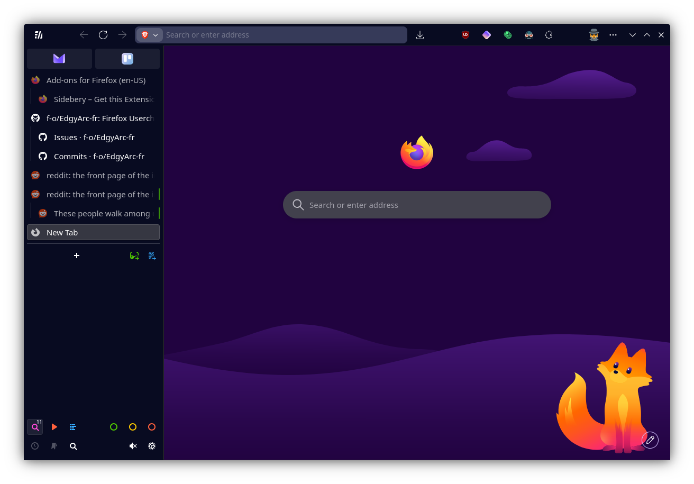

> [!WARNING]  
> This is my custom version of this theme, made to follow my specific usecase. This will be a super slimmed down version of the original code, with most of the "custom config-flags" removed. My focus is not on adding new features, but as I actually use this myself, I will try to fix any breaking changes down the line.

 

# EdgyArc-fr
*Because Arc and Edge look pretty af but FOSS FTW*

## Features

- Based on [EdgyArc-fr (Loskir fork)](https://github.com/Loskir/EdgyArc-fr)
  - Which is based on [EdgyArc-fr](https://github.com/artsyfriedchicken/EdgyArc-fr)
    - Which is based on [Edge-frfox](https://github.com/bmFtZQ/edge-frfox)
- Sidebar Modifications
- Custom Sidebery theme
- Auto-hide native top tabs when Sidebery is active

## Usage

### Step 1 - Installation

#### 🔵 Install addons

- [Sidebery](https://addons.mozilla.org/firefox/addon/sidebery/)
- [Firefox Color](https://addons.mozilla.org/en-US/firefox/addon/firefox-color/) `[OR]` [Adaptive Tab Bar Color](https://addons.mozilla.org/en-GB/firefox/addon/adaptive-tab-bar-colour/)

#### 🔵 Install and Configure Base theme

  - Clone the repository to your local machine.
  - Copy the contents of the `chrome` folder into your Firefox profile's `chrome` folder.
    - *Protip: Create a symbolic-link from the git folder, to better test changes you make.*
  - Go to `about:config` and set these properties to `true`
    - `toolkit.legacyUserProfileCustomizations.stylesheets`
    - `svg.context-properties.content.enabled`
    - `af.edgyarc.edge-styles`
    - `af.sidebery.edgyarc-theme`

### Step 2 - Configure EdgyArc

> [!NOTE]  
> This section has been omitted completely, as many of the configurable settings has been/will be removed from this fork.
> Please check out [the original repo](https://github.com/Loskir/EdgyArc-fr) if you're interested in these custom configurations.

### Step 3 - Import Sidebery configs

Import the following into sidebery (`Sideberry Settings` > `Help` > `Import Addon Data`)

- `sidebery-settings.json` Contains settings for the addon that **will** overwrite your own settings.

## License

This project is licensed under the [Mozilla Public License 2.0](https://opensource.org/licenses/MPL-2.0), and is a fork of Loskir's [EdgyArc-fr](https://github.com/Loskir/EdgyArc-fr). 

All appracial goes to the original author!